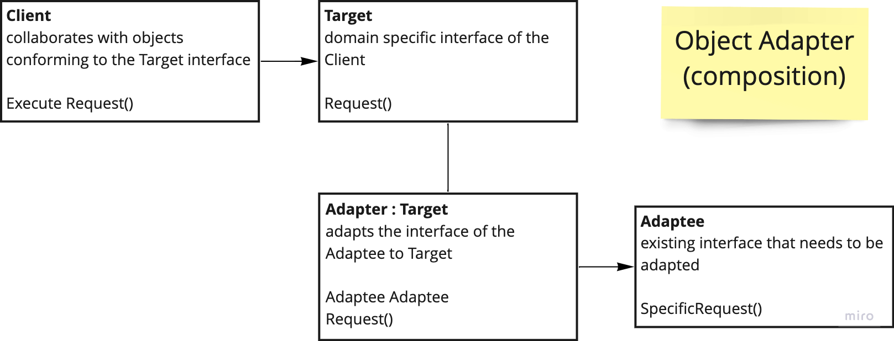
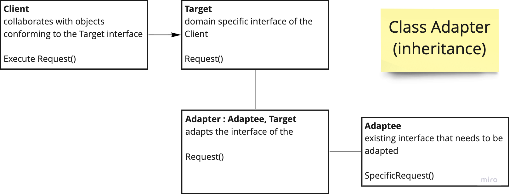

# Adapter

---
### Convert the interface of a class into another interface clients expect. Adapter allows classes to work together that couldn't do otherwise because of interface incompatibility.

### There are two main versions Object Adapter that is based on Composition and Class Adapter that leverage inheritance

## Diagrams:

---

---
### Use:

- When needs to use existing class but the interface doesn't match
- Creation of reusable class (adapter) that works with incompatible interface classes
- Use several existing subclasses that need to adapt their interfaces

### Consequences:

- One adapter can work with many adapters and at the same time extend their functionality
- The interface (adapted) is separated out from the rest of the code => SRP
- Adding new adapters can be done without breaking client code => OCP

### Cons:

- Limiting the Override Adaptee behavior
- Increased complexity