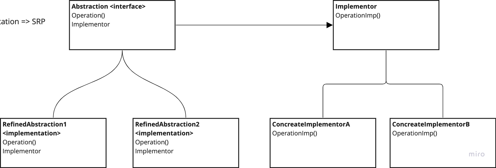

# Bridge

---
## Intent is to decouple an abstraction from its implementation so the two can vary independently.

## Diagram:

---
### Use:
- Avoid a permanent binding of abstraction and implementation (switch at run time)
- Enable abstraction and implementation extensibility with subclasses
- Minimize the impact on the client when implementation of abstraction changes.

### Consequences:
- Decoupling the implementation from permanently being bound to abstraction
- Abstraction and Implementation can evolve independently => OCP
- Hiding implementation details away from clients
- Focus on high-level logic of abstraction and on the details in the implementation => SRP