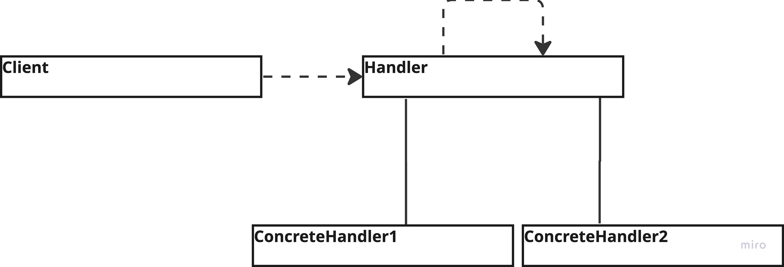

# Chain Of Responsibility

---
## The intent of this pattern is to avoid coupling the sender of a request to its receiver by giving more than one object a chance to handle the request. It does that by chaining the receiving objects and passing the request along the chain until an object handles it.

## Diagram:

---
### Use:
- When more than one object may handle a request and the handler isn't known beforehand
- When you want to issue a request to one of several objects (handlers) without specifying the receiver explicitly
- When the set of objects that handle a request should be specified dynamically

### Consequences:
- It enables reduced coupling
- Works towards a single responsibility per class
- Adds flexibility in regards to assigning responsibilities to objects

### Cons:
- It does not guarantee receipt of the request