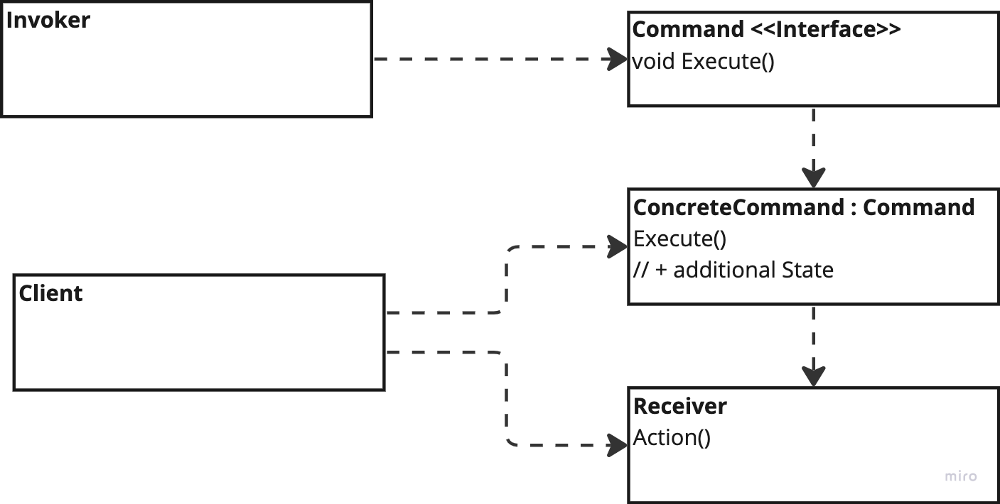

# Command

---
## The intent of this pattern is to encapsulate a request as an object, thereby letting you parameterise clients with different requests , queue or log requests, and support undoable operations.

## Diagram:

---
### Use:
- Parametrise objects with an action to perform
- Supporting Undo
- Specify, queue and execute requests at different times
- Store a list of changes to reapply later

### Consequences:
- Decouple the invoker and receiver
- Commands can be manipulated and extended
- Can be assembled into composite command
- Easy to add new commands

### Cons:
- Increase complexity