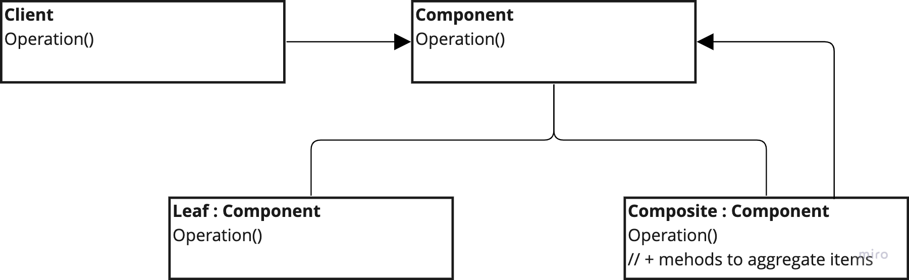

# Composite

---
## The intent of this pattern is to compose objects into tree structures to represent part-whole hierarchies. As such, it lets clients treat individual objects and compositions of objects uniformly, as if they all were individual objects.

## Diagram:

---
### Use:
- When need to represent part-whole hierarchies of objects
- When want to ignore the differences between compositions of objects and individual object

### Consequences:
- Simple clients
- Easy to add new kinds of components => OCP

### Cons:
- Can lead to too generic systems