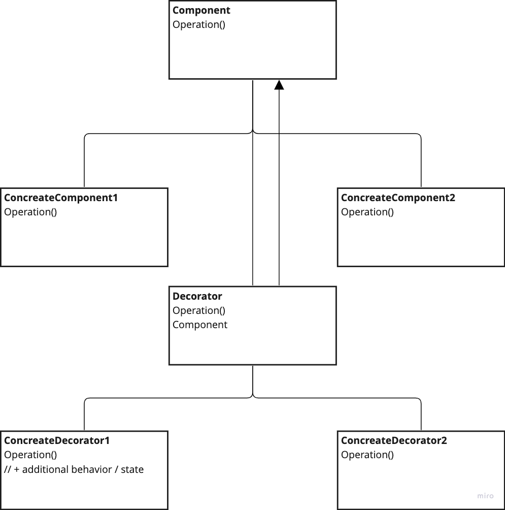

# Decorator

---
## The intent of this pattern is to extend and attach additional responsibilities to an object dynamically. A decorator can provide a flexible alternative to inheritance for new functionalities.

### It's important to distinguish that we use the Decorator Pattern to add functionality to an instance of a class at runtime (object) not to the class itself.

## Diagram:

---
### Use:
- Need to add behaviours to objects at runtime without affecting other objects
- Need to remove responsibilities attached to object
- When extension with subclassing is impractical or impossible

### Consequences:
- More flexible than static inheritance, easy to add or remove responsibilities
- Useful to split feature-loaded classes to follow SRP
- Increased granularity of the system due to the amount of small, simple classes