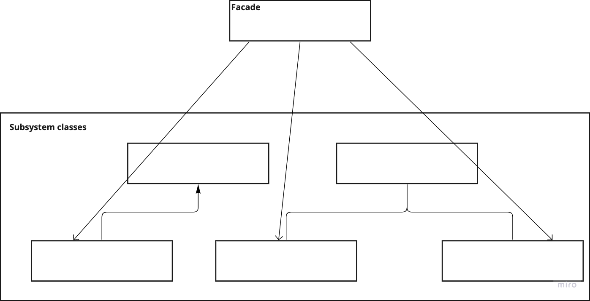

# Facade

---
## The intent of this pattern is to provide a unified interface to a set of interfaces in a subsystem. It defines a higher-level interface that makes the subsystem easier to use.

## Diagram:

---
### Use:
- Provide a simple interface into a complex subsystem
- When there are many dependencies between a client and the implementation classes of the abstraction.

### Consequences:
- The number of object clients have to deal with are reduced
- Promotes weak coupling between the subsystem and its clients => OCP
- Clients are not forbidden to use subsystem classes