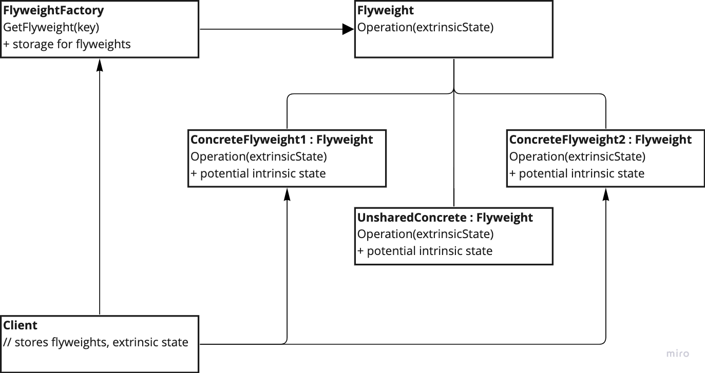

# Flyweight

---
## The intent of this pattern is to use sharing to support a large number of fine-grained objects efficiently. It does that by sharing parts of the state between these objects instead of keeping all that state in all the objects.

## Variation of UnsharedConcreteFlyweight loses the advantage of state storing but still provides transparency to work with Flyweight objects for the client.

## Diagram:

---
### Use: (in case of this pattern - all must be true!)
- When the application use numerous objects
- When storage costs are high but to large amount of objects
- When most of the object state can be made extrinsic
- If after removal extrinsic state, a large group of objects can be replaced by few shared objects
- Application does not require object identity

### Consequences:
- Saves a lot of memory

### Cons:
- Might increase processing costs
- Pattern is quite complex which translate to complex code base also