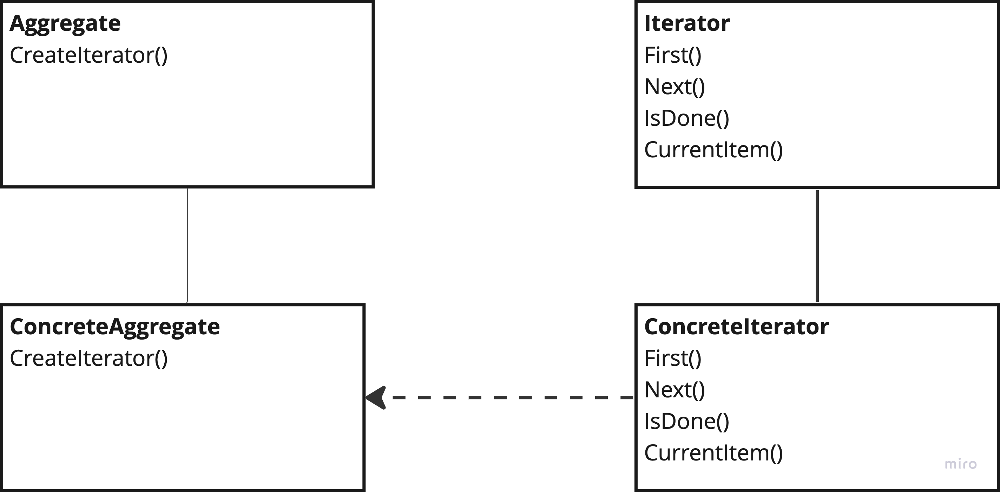

# Iterator

---
## The intent of this pattern is to provide a way to access the elements of an aggregate object sequentially, without exposing its underlying representation.

## Diagram:

---
### Use:
- When you want to access an aggregate object's content without exposing its internal representation 
- When you want to support multiple ways of traversal fo the same aggregate object 
- When you want to avoid code duplication in regards to traversing the aggregate object

### Consequences:
- Iterators simplify the interface of your aggregate structure as traversal code is separated out 
- You can implement new types of aggregate objects an iterators without them interfering with each other 
- Iterators can exist next to each other at the same time on the same collection

### Cons:
- Can be a overkill when you only use simple traversal and collections