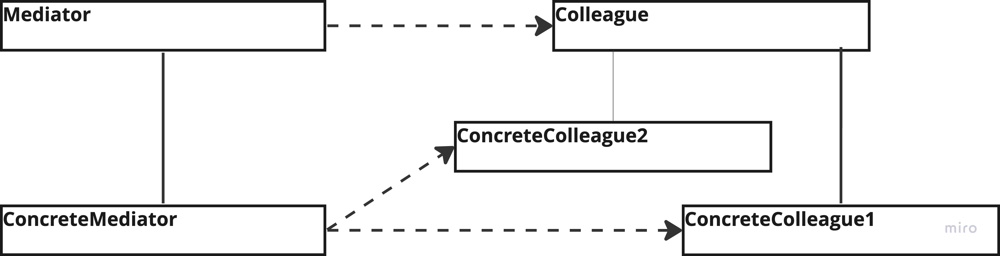

# Mediator

---
## The intent of this pattern is to define an object - the mediator - that encapsulates how a set of objects interact. It does that by forcing objects to communicate via that mediator.

## Diagram:

---
### Use:
- When a set of object communicate  in well-defined but complex way
- When, because an object refers to and communicates with many other objects, the object is difficult to reuse
- When behavior that's distributed between several classes should be customizable without a lot of subclassing

### Consequences:
- Limits subclassing
- Decouples colleagues
- Simplifies object protocols
- New mediators can be introduced without having to change the components

### Cons:
- It centralizes control, wich can make the mediator turn into a monolith