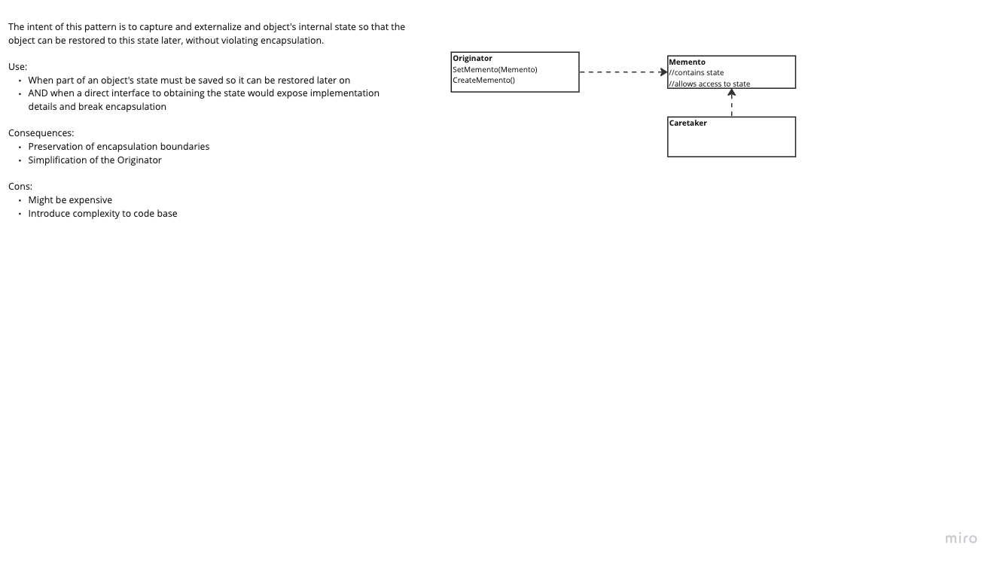

# Memento

---
## The intent of this pattern is to capture and externalize and object's internal state so that the object can be restored to this state later, without violating encapsulation.

## Diagram:

---
### Use:
- When part of an object's state must be saved so it can be restored later on
- AND when a direct interface to obtaining the state would expose implementation details and break encapsulation

### Consequences:
- Preservation of encapsulation boundaries
- Simplification of the Originator

### Cons:
- Might be expensive
- Introduce complexity to code base