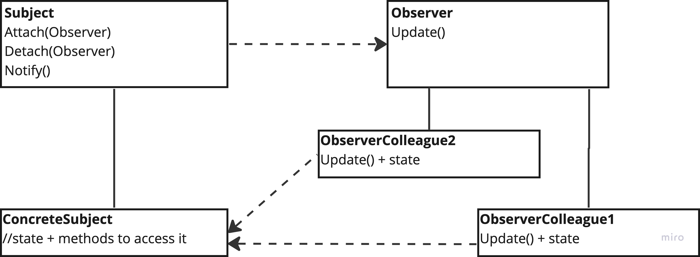

# Observer

---
## The intent of this pattern is to define a one-to-many dependencies between objects so that when one object changes state, all its dependents aer notified and updated automatically.

## Diagram:

---
### Use:
- When a change to one object requires changing others, and you don't know in advance how many objects need to be changed
- When objects that observe others aer not necessarily doing that for the total amount of time the application runs
- When an object should be a ble to notify other objects without making assumptions about who those objects are
### Consequences:
- It allows subjects and observers to vary independently: subclasses can be added and change without having to change others
- Subject and observer are loosely coupled

### Cons:
- It can lead to a cascade of unexpected updates