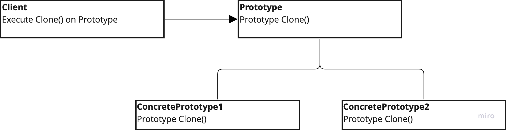

# Prototype

---
## The intent of this pattern is to specify the kinds of objects to create using a prototypical instance, and  create new objects by copying this prototype.

## Diagram:

---
### Use:
- System should be independent of how its objects are created, and to avoid building a set of factories that mimics the class hierarchy
- System should be independent of how its objects are created, when instances of a class can have one of only a few different combinations of states

### Consequences:
- Hides the Concrete product classes from the client
- Reduce subclassing

### Cons:
- Each prototype class must implement its own clone method