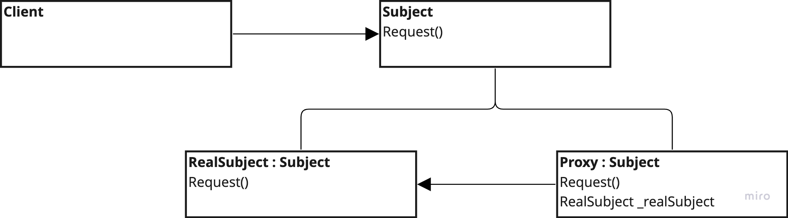

# Proxy

---
## The intent of this pattern is to provide a surrogate or placeholder for another object to control access to it.

## Design:

---
### Variations:
- Remote Proxy => Client communicate with the proxy, feels like local resource
- Virtual Proxy => Allows creating expensive objects on demand
- Smart Proxy => Allows adding logic around the subject
- Protection Proxy => Used to control access to an object

### Use:
- Provide a local representative
- Create expensive objects when needed
- Caching or locking scenarios
- Controlling access levels

### Consequences:
- Hides the fact that an object resides in different network
- Defer object creation
- Additional housekeeping tasks can be executed when object is accessed
- Granular control over access to objects
- Allows introduction of new proxies without changing the client code

### Cons:
- More complexity due to additional classes
- Performance impact due to stacking layers