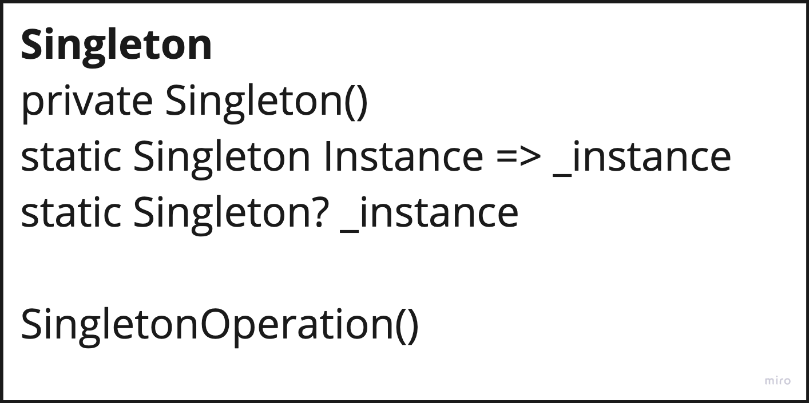

# Singleton

---
### Singleton pattern ensures that a class has only one instance for the life of the application, providing at the same time, well known, global access point. One of the use case example can be a Logger instance in a system. This pattern makes the class responsible for ensuring only one instance of itself exists.

---
## Diagram:

---
### Use Case

- Only one instance of a class has to be accessible to the clients
- Instance should be extensible by subclassing, clients should be able to use an extended instance without need for modification

### Consequences:

- Allows for strict access control
- Reduce pollution of global variables
- Subclassing allows change of configuration at runtime
- Multiple instance can be allowed without altering client

### Cons:

- Violates Single Responsibility Principal as object controls both creation and lifecycle of itself *(Above is resolved with modern DIC in modern frameworks)*
