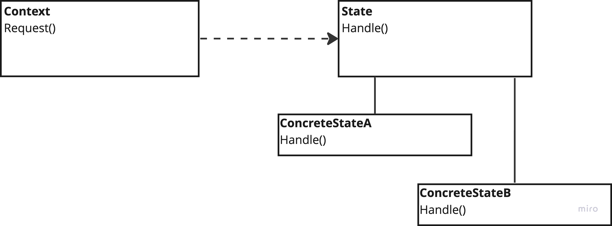

# Memento

---
## The intent of this pattern is to allow an object to alter its behavior when its internal state changes. The object will appear to change its class.

## Diagram:

---
### Use:
- When an object's behavior depends on its state and it must change it at runtime (depending on that state)
- When your objects are dealing with large conditional statements that depend on the object's state.
### Consequences:
- Localizes state-specific behavior and partitions behavior for different states
- New states and transitions can easily be added by defining new subclasses

### Cons:
- The number of classes is increased, which adds additional complexity