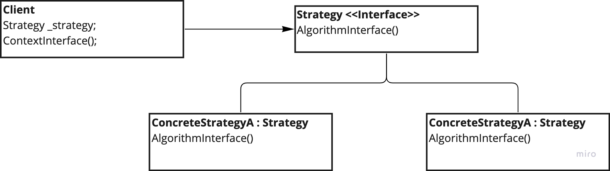

# Strategy

---
## The intent of this pattern is to define a family of algorithms, encapsulate each one, and make interchangeable. Strategy lets the algorithm very independently from clients that use it.

## Design:

---
### Use:
- When many related classes differ only in their behaviour
- Need for different variants of an algorithm which you want to be able to switch at runtime
- Hide the data, code or dependencies from the client
- When a class defines many different behaviours which appear as a bunch of conditional statements

### Consequences:
- Alternative to subclassing the context (composition over inheritance)
- New strategies can be introduced without having to change the context => OCP
- Eliminates conditional statements
- Provide a choice of implementations with the same behaviour

### Cons:
- If the client injects the strategy, it must be aware of how strategies differ
- There's overhead in communication between the strategy and the context
- Increasing complexity