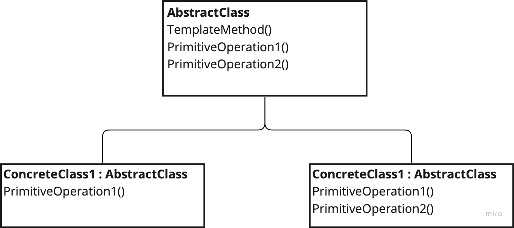

# Template 

---
## The intent of this pattern is to define the skeleton of an algorithm in an operation, deferring some steps to subclasses. It lets subclasses redefine certain steps of an algorithm without changing the algorithms structure.

## Diagram:

---
### Use:
- When you want to implement invariant parts of an algorithm only once, and give subclasses space to implement rest of the behaviour
- Control what part of an algorithm can vary
- Define set of algorithms that do not vary much

### Consequences:
- Fundamental technique for code reuse

### Cons:
- Template methods are rigid, the order of methods they call is fixed